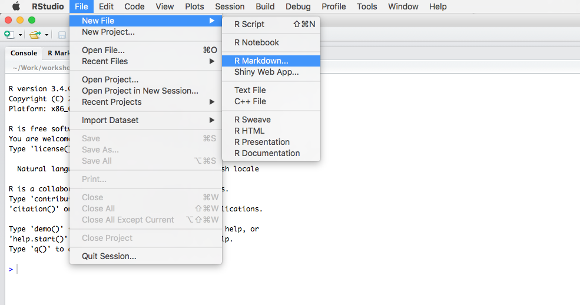
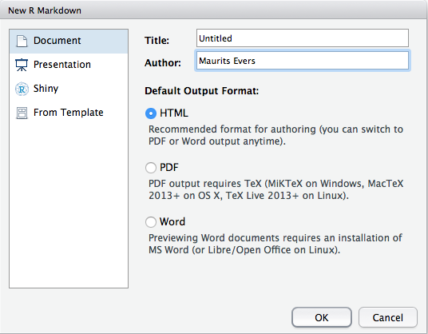

<script type="text/x-mathjax-config">
MathJax.Hub.Config({
  CommonHTML: {
    scale: 130
  }
});
</script>

<style>
  .col2 {
    columns: 2 200px;         /* number of columns and width in pixels*/
    -webkit-columns: 2 200px; /* chrome, safari */
    -moz-columns: 2 200px;    /* firefox */
  }
  .col3 {
    columns: 3 100px;
    -webkit-columns: 3 100px;
    -moz-columns: 3 100px;
  }
</style>


# Prerequisities


## Prerequisities 1

**What to know?**

1. Basic R skills
2. Basic Unix/Linux skills

**What to bring?**

1. Bring laptop
2. A GitHub account?


## Prerequisities 2

**Which R packages to install/load?**
```{r results="hide", message=FALSE, warning=FALSE}
pkg <- c("ggplot2", "rmarkdown", "knitr", "dplyr");
lapply(pkg, function(x) { if (!require(x, character.only = TRUE, quietly = TRUE)) {
  install.packages(x);
  require(x, quietly = TRUE)}
})
```

**What data to work with?**

We will use the `starwars` dataset from `dplyr`.
```{r}
head(starwars, n = 4);
```


## How to get started 1

**Create new R Markdown document in RStudio**

1. File $\rightarrow$ New File $\rightarrow$ R Markdown

```{r echo=FALSE, out.width="800px"}

```


## How to get started 2
<ol start="2">
<li> Specifiy output option

```{r echo=FALSE, out.width="450px"}

```

<div class="boxed">
**Exercise:** Create a new R Markdown document in RStudio
</div>


# (R) Markdown 101


## (R) Markdown 101

A note on different Markdown flavours: GitHub, R Markdown, vanilla Markdown, ...

Focus here on R Markdown.

1. Headers
2. Emphasis: bold and italics
3. Lists: Ordered and unordered
4. Images and links
5. Blockquotes


## (R) Markdown 101: Headers

...


## (R) Markdown 101: Images

1. Use ``
2. Use HTML ``
3. Use `knitr::include_graphics`


# From Markdown to R Markdown 


## R Markdown output

1. Word  
    [[http://rmarkdown.rstudio.com/word_document_format.html]](http://rmarkdown.rstudio.com/word_document_format.html)
2. PDF  
    [[http://rmarkdown.rstudio.com/pdf_document_format.html]](http://rmarkdown.rstudio.com/pdf_document_format.html)
3. HTML  
    [[http://rmarkdown.rstudio.com/html_document_format.html]](http://rmarkdown.rstudio.com/html_document_format.html)

<div class="boxed">
**Exercise:** Create different output documents
</div>


## The YAML header

1. Title and subtitle
2. Author
3. Date
4. Output option

More details for every output option

<div class="boxed">
**Exercise:** Change the title/author/date fields of your Rmd document.
</div>


# R Markdown elements


## Controlling the R output: Code chunk options

**Some useful options:**

- `eval=FALSE`: Don't run code.
- `include=FALSE`: Run code but don't include the chunk in the output document.
- `echo=FALSE`: Don't show code, show results.
- `results='hide'`: Show code, don't show results.
- `message=FALSE`: Don't show any additional R messages.
- `error=FALSE`: Don't show R error messages.
- `warning=FALSE`: Don't show R warning messages.
- `cache=TRUE`: Use cached results (if available) until the code chunk is changed.
- `fig.width=7, fig.height=7`: Set figure width and height to 7 inches.

More chunk options can be found in e.g. the [R Markdown Reference Guide](https://www.rstudio.com/wp-content/uploads/2015/03/rmarkdown-reference.pdf).

<div class="boxed">
**Exercise:** Experiment with different code options: Disable output, results, and code evaluation.
</div>


## Tables

1. General: How to output tables/dataframes?
2. `knitr::kable()`
3. `tibble::print.tbl_df()`
4. `DT::datatable()`

<div class="boxed">
**Excercise:** Output a table, and use different layout options.
</div>


## Tables: `knitr::kable()`

```{r}
suppressMessages(library(knitr));
kable(starwars[1:4, 1:4])
```


## Tables: `DT::datatable()`

```{r}
suppressMessages(library(DT));
#DT::datatable(starwars, options = list(dom = "ftp", scrollX = TRUE, pageLength = 4));
DT::datatable(starwars[, 1:4], options = list(pageLength = 8));
```


## Interactive plots

1. plotly
2. D3 in R

**Load the necessary libraries:**
```{r}
suppressMessages(library(ggplot2));
suppressMessages(library(plotly));
suppressMessages(library(scatterD3));
```


## Interactive plots: `plotly::ggplotly()`

```{r}
ggplotly(ggplot(starwars, aes(x = height, y = mass, label = name)) + geom_point(), height = 5);
```


## Interactive plots: `scatterD3::scatterD3()`

```{r, fig.height=4.5, fig.width=10}
scatterD3(x = starwars$height, y = starwars$mass, lab = starwars$name);
```


## Beyond interactive plots

R Markdown and shiny


## Link with github

...