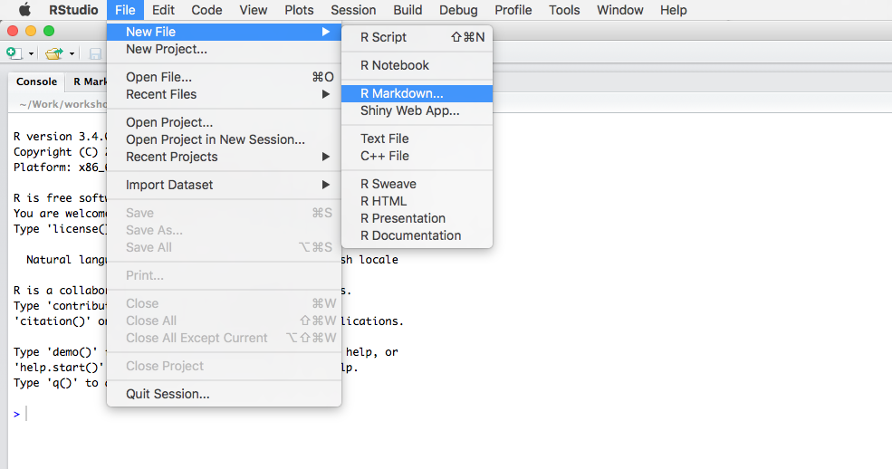

<script type="text/x-mathjax-config">
MathJax.Hub.Config({
  CommonHTML: {
    scale: 130
  }
});
</script>


## Prequesities

**What to know?**
1. Basic R skills
2. Basic Unix/Linux skills

**What to bring?**
1. Bring laptop
2. A GitHub account?


# Prerequisities


## How to get started
1. Start RStudio
2. Create new R Markdown document

```{r echo=FALSE, out.width="500px"}

```
3. Specifiy output option


# Markdown 101


## Markdown 101

1. Headers
2. Emphasis: bold and italics
3. Lists: Ordered and unordered
4. Images and links
5. Blockquotes

A note on different Markdown flavours: GitHub, R Markdown, vanilla Markdown, ...


## Markdown 101: Headers

...


## Markdown 101: Images

1. Use ``
2. Use HTML ``
3. Use `knitr::include_graphics`


# From Markdown to R Markdown 


## R Markdown output

1. Word
2. PDF
3. HTML

Exercise: Create different output documents


## The YAML header

1. Title and subtitle
2. Author
3. Date
4. Output option

More details for every output option


# R Markdown elements


## Controlling the R output

1. Chunk options
2. Plot dimensions
3. Transparency

Exercise: Show different chunk options


## Tables

1. General: How to output tables/dataframes?
2. Show `DT::datatable` example.

Excercise: Output a table


## Interactive plots

1. D3 in R
2. plotly


## Beyond interactive plots

R Markdown and shiny


## Link with github

...